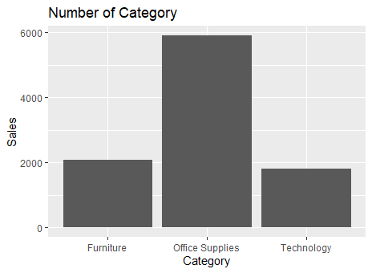

# R-Assignment 4

**Created by Pornticha Sangmanee (ID: 63130500084)**


Choose Dataset:
    
- Superstore Sales Dataset (Data from Rohit Sahoo,[Kaggle](https://www.kaggle.com/rohitsahoo/sales-forecasting)) >> [Using CSV](https://raw.githubusercontent.com/safesit23/INT214-Statistics/main/datasets/superstore_sales.csv)


### Outlines
1. Explore the dataset
2. Learning function from Tidyverse
3. Transform data with dplyr and finding insight the data
4. Visualization with GGplot2

## Part 1: Explore the dataset

```
#Import library
install.packages(ggplot2)
library(dplyr)
library(stringr)
library(readr)
library(ggplot2)
library(DescTools)
library(forcats)
library(scales)

#Dataset
superstore <- read_csv("https://raw.githubusercontent.com/safesit23/INT214-Statistics/main/datasets/superstore_sales.csv")

#Explore dataset
View(superstore)
glimpse(superstore)
```

Dataset มีจำนวนข้อมูลทั้งหมด 9,800 rows และมีทั้งหมด 18 columns 
```
Rows: 9,800
Columns: 18
$ Row.ID        <dbl> 1, 2, 3, 4, 5, 6, 7, 8, 9, 10, 11, 12, 13, 14, 15, 16, 17, 18, 19, 20, 21, 22, 23, 24, 25, 26, 27, 28…
$ Order.ID      <chr> "CA-2017-152156", "CA-2017-152156", "CA-2017-138688", "US-2016-108966", "US-2016-108966", "CA-2015-11…
$ Order.Date    <chr> "08/11/2017", "08/11/2017", "12/06/2017", "11/10/2016", "11/10/2016", "09/06/2015", "09/06/2015", "09…
$ Ship.Date     <chr> "11/11/2017", "11/11/2017", "16/06/2017", "18/10/2016", "18/10/2016", "14/06/2015", "14/06/2015", "14…
$ Ship.Mode     <chr> "Second Class", "Second Class", "Second Class", "Standard Class", "Standard Class", "Standard Class",…
$ Customer.ID   <chr> "CG-12520", "CG-12520", "DV-13045", "SO-20335", "SO-20335", "BH-11710", "BH-11710", "BH-11710", "BH-1…
$ Customer.Name <chr> "Claire Gute", "Claire Gute", "Darrin Van Huff", "Sean O'Donnell", "Sean O'Donnell", "Brosina Hoffman…
$ Segment       <chr> "Consumer", "Consumer", "Corporate", "Consumer", "Consumer", "Consumer", "Consumer", "Consumer", "Con…
$ Country       <chr> "United States", "United States", "United States", "United States", "United States", "United States",…
$ City          <chr> "Henderson", "Henderson", "Los Angeles", "Fort Lauderdale", "Fort Lauderdale", "Los Angeles", "Los An…
$ State         <chr> "Kentucky", "Kentucky", "California", "Florida", "Florida", "California", "California", "California",…
$ Postal.Code   <int> 42420, 42420, 90036, 33311, 33311, 90032, 90032, 90032, 90032, 90032, 90032, 90032, 28027, 98103, 761…
$ Region        <chr> "South", "South", "West", "South", "South", "West", "West", "West", "West", "West", "West", "West", "…
$ Product.ID    <chr> "FUR-BO-10001798", "FUR-CH-10000454", "OFF-LA-10000240", "FUR-TA-10000577", "OFF-ST-10000760", "FUR-F…
$ Category      <chr> "Furniture", "Furniture", "Office Supplies", "Furniture", "Office Supplies", "Furniture", "Office Sup…
$ Sub.Category  <chr> "Bookcases", "Chairs", "Labels", "Tables", "Storage", "Furnishings", "Art", "Phones", "Binders", "App…
$ Product.Name  <chr> "Bush Somerset Collection Bookcase", "Hon Deluxe Fabric Upholstered Stacking Chairs, Rounded Back", "…
$ Sales         <dbl> 261.9600, 731.9400, 14.6200, 957.5775, 22.3680, 48.8600, 7.2800, 907.1520, 18.5040, 114.9000, 1706.18…
```


## Part 2: Learning function from Tidyverse


### Package `dplyr` 
- `select()` : เลือกคอลัมน์และข้อมูลทั้งหมดในคอลัมน์นั้น

```R
superstore %>% select(`Customer Name`, Country , City,`Order ID`)
```

### Package `forcats`
- `fct_infreq()` : ใช้การจัดลำดับข้อมูลตามความถี่
```R
superstore %>% mutate(state = fct_infreq(State)) %>% count(state)
```


## Part 3: Transform data with dplyr and finding insight the data
1. แสดงจำนวนคนสั่งของในแต่ละเมือง
```R
superstore_sale %>% group_by(City) %>% summarise("total" = length(City))
```
Result:
```
# A tibble: 529 x 2
   City        total
   <chr>       <int>
 1 Aberdeen        1
 2 Abilene         1
 3 Akron          20
 4 Albuquerque    14
 5 Alexandria     16
 6 Allen           4
 7 Allentown       7
 8 Altoona         2
 9 Amarillo       10
10 Anaheim        19
# ... with 519 more rows
```

------

2. ลูกค้าที่มีการซื้อสินค้ามากที่สุด
```R
CustomerMostBuy <- superstore %>% select(`Customer Name`,`Customer ID`,Sales) %>% filter(superstore$Sales == max(superstore$Sales));
```
Result:
```
  `Customer Name` `Customer ID`  Sales
  <chr>           <chr>          <dbl>
1 Sean Miller     SM-20320      22638.
```
Explain 
>> ลูกค้าที่มีการซื้อสินค้ามากที่สุดคือ Sean Miller ID: SM-20320 ราคา 22638
-------

3. ในแต่ละภาคมีการสั่งซื้อสินค้าภาคละเท่าไหร่
```R
superstore$Region<-as.factor(superstore$Region)
summary(superstore$Region)
```
Result:
```
Central    East   South    West 
   2277    2785    1598    3140 
```
Explain 
>> การสั่งซื้อสินค้าในแต่ละภาคมีดังนี้ ภาคกลาง 2277 ภาคตะวันออก 2785  ภาคใต้ 1598  ภาคตะวันตก 3140 

-------

4. มีประเทศและเมืองไหนบ้างที่ไม่ซ้ำกันโดยการใช้คำสั่ง distinct
```R
superstore %>% distinct(Country,City)
```
Result:
```
 Country       City           
   <chr>         <fct>          
 1 United States Henderson      
 2 United States Los Angeles    
 3 United States Fort Lauderdale
 4 United States Concord        
 5 United States Seattle        
 6 United States Fort Worth     
 7 United States Madison        
 8 United States West Jordan    
 9 United States San Francisco  
10 United States Fremont        
# ... with 519 more rows
```
-------

5. เดือนที่มีการสั่งสินค้ามากที่สุด 5
```R
superstore$`Order Date` <- as.Date(as.character(superstore$`Order Date`),"%d/%m/%Y")
class(superstore$`Order Date`)

superstore$OrderMonth <- format(superstore$`Order Date`, "%m") 
Top5OrderMonth <- superstore %>% select(OrderMonth) %>% count(OrderMonth) %>% arrange(desc(n)) %>% slice(1:5)
as_tibble(Top5OrderMonth)
```
Result:
```
OrderMonth     n
  <chr>      <int>
1 11          1449
2 12          1382
3 09          1354
4 10           809
5 05           725
```
Explain 
>> เดือนที่มีการสั่งสินค้ามากที่สุดได้แก่
1. 11 (เดือนพฤศจิกายน)     1449
2. 12 (เดือนธันวาคม)       1382
3. 09 (เดือนกันยายน)       1354
4. 10 (เดือนตุลาคม)        809
5. 05 (เดือนพฤษภาคม)      725

-------

6. หายอดขายรวมของสินค้าในแต่ละประเภทว่ามียอดขายเป็นเท่าไหร่
```R
superstore %>% group_by(Category) %>% select(Category,Sales) %>% summarise(total = sum(Sales))
```
Result:
```
Category          total
  <chr>             <dbl>
1 Furniture       728659.
2 Office Supplies 705422.
3 Technology      827456.
```
Explain 
>> ยอดขายรวมของสินค้า
1. Furniture มียอดขาย 728659 
2. Office Supplies มียอดขาย 705422 
3. Technology มียอดขาย 827456 
ใช้ group_by() เพื่อแยกกลุ่มตามหมวดหมู่ และใช้ summarise() เพื่อรวมยอดของแต่ละหมวดหมู่ด้วยคำสั่ง sum
-------

## Part 4: Visualization with GGplot2
### 1.) Graph show relation between height and mass
```
scat_plot <- starwars %>% filter(mass<500) %>% ggplot(aes(x=height,y=mass))+
  geom_point(aes(color=gender))

scat_plot+geom_smooth()
```
Result:


**Guideline:
Embed Image by using this syntax in markdown file
````

````

## Part 4: Visualization with GGplot2
### 1.) กราฟแสดงสัดส่วนของประเภทลูกค้าที่เคยสั่งซื้อสินค้าในช่วง 4 ปีที่ผ่านมา
```R
group_segment <- data.frame(table(Orders$Segment))
group_segment <- group_segment %>% rename("segment"=Var1,"count"=Freq)

group_segment %>% 
  ggplot(aes(x="",y=count,fill=segment)) + 
  geom_bar(stat="identity", width=1, color="white") +
  coord_polar("y", start=0)+
  theme_void() +
  geom_text(aes(label = percent(count/sum(count))),
                position = position_stack(vjust = 0.5))
```
Result:



### 2.) กราฟแสดงความถี่ในการสั่งซื้อของของลูกค้า ในแต่ละช่วงราคา
```R
SalePrice <- Orders %>% select(Sales)
col1<-table(cut(SalePrice$Sales,breaks=seq(from=0.0,to=10000,by=100)))
col2<-data.frame(col1)
col2<-col2 %>% rename("Range"=Var1)

col2 %>% filter(Freq > 50) %>%
  ggplot(aes(x=Range,y=Freq))+ 
  geom_bar(fill="#add8e6",stat = "identity")+
  coord_flip()+
  geom_text(aes(label = Freq), position = position_identity())
```
Result:


### 3.) กราฟแสดงยอดรวมราคาสินค้าที่สั่งซื้อในแต่ละปี
```R
totalPrice_year <- Orders %>% 
  mutate(year = Year(Orders$`Order Date`)) %>% 
  group_by(year) %>% summarise(Sum_price = sum(Sales)) %>% arrange(year)

totalPrice_year %>%
  ggplot(aes(x=year,y=Sum_price))+ 
  geom_bar(fill="#228B22",stat = "identity") +
  geom_text(aes(label = Sum_price), position = position_identity()) + 
  coord_flip()+
  theme_light()+
  ggtitle("Total price each year of SaleStore")+
  xlab("Years") + ylab("Total price")
```
Result:


------

#### Part B : [Dashboard in Power BI](https://app.powerbi.com/view?r=eyJrIjoiODEwYTk2ODEtMDI2ZS00Njc2LWFjZjgtM2EwYmNiNTVmNWM5IiwidCI6IjZmNDQzMmRjLTIwZDItNDQxZC1iMWRiLWFjMzM4MGJhNjMzZCIsImMiOjEwfQ%3D%3D)
